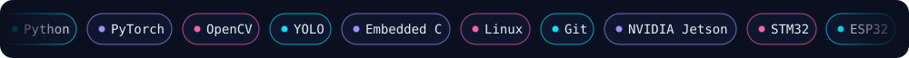

 

  

 

## ⚡ About

I'm an **AI Engineer** working on computer vision, deep learning and perception. I build production systems that turn raw video into structured, metric insight, and I've worked across **ADAS**, **aerospace** and **space-grade electronics**. I like the place where new models meet real hardware and real roads.

## 💼 Experience

## 🔬 Projects

## 🏆 Achievements

## 📊 GitHub Stats

## 📬 Let's build something

Open to conversations about perception, autonomy and edge AI. Reach me at **s7.tejas@gmail.com** or on [LinkedIn](https://www.linkedin.com/in/tejas-s-57298325a/).

