 

 

## ⚡ What I'm about

I build systems that **perceive and act**: computer vision, autonomy and edge AI.
Bengaluru-based AI engineer, ex-CSIR-NAL, Dots Autonomous (ADAS) and Spacechips (UK), and an **ISRO Startup** winner.
I like the place where new models meet real hardware and real roads.

## 🛰️ Right now

| | |
|---|---|
| 🚗 **Building** | [OpenRoad-Autonomy](https://github.com/Tejascodz/OpenRoad-Autonomy): path planning for autonomous delivery robots / ADAS |
| 🧠 **Exploring** | vision-language models, on-device inference, agentic workflows |
| 🔭 **Watching** | space tech, autonomy stacks, whatever ships next in AI |

## 🧰 Toolbox

## 📊 Stats

## 📬 Let's build something

<!-- Add your links below, e.g.

-->

